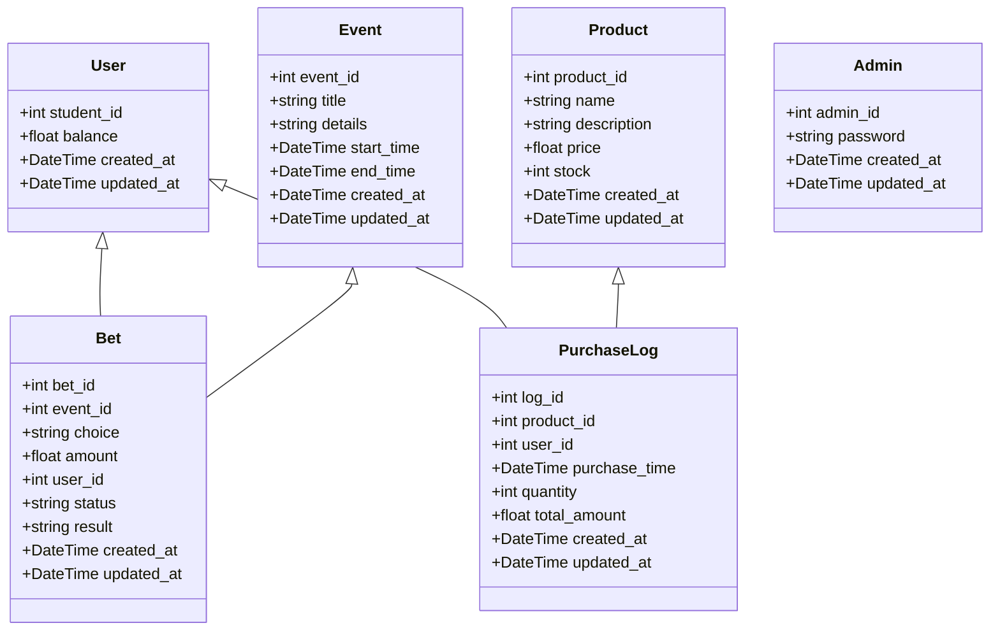

```mermaid
classDiagram
    User <|-- Bet
    User <|-- PurchaseLog
    Event <|-- Bet
    Product <|-- PurchaseLog

    class User {
        +int student_id
        +float balance
        +DateTime created_at
        +DateTime updated_at
    }

    class Event {
        +int event_id
        +string title
        +string details
        +DateTime start_time
        +DateTime end_time
        +DateTime created_at
        +DateTime updated_at
    }

    class Bet {
        +int bet_id
        +int event_id
        +string choice
        +float amount
        +int user_id
        +string status
        +string result
        +DateTime created_at
        +DateTime updated_at
    }

    class Product {
        +int product_id
        +string name
        +string description
        +float price
        +int stock
        +DateTime created_at
        +DateTime updated_at
    }

    class PurchaseLog {
        +int log_id
        +int product_id
        +int user_id
        +DateTime purchase_time
        +int quantity
        +float total_amount
        +DateTime created_at
        +DateTime updated_at
    }

    class Admin {
        +int admin_id
        +string password
        +DateTime created_at
        +DateTime updated_at
    }

```
