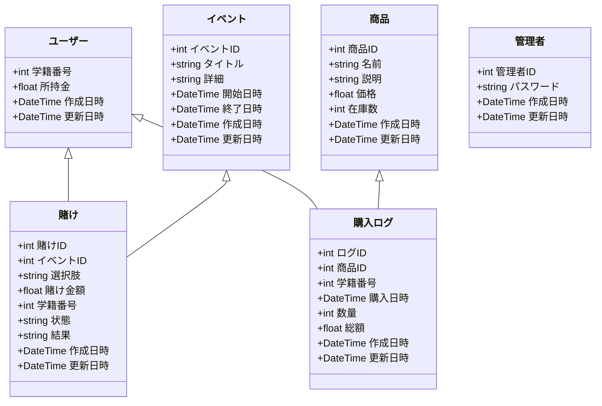

```mermaid
classDiagram
    ユーザー <|-- 賭け
    ユーザー <|-- 購入ログ
    イベント <|-- 賭け
    商品 <|-- 購入ログ

    class ユーザー {
        +int 学籍番号
        +float 所持金
        +DateTime 作成日時
        +DateTime 更新日時
    }

    class イベント {
        +int イベントID
        +string タイトル
        +string 詳細
        +DateTime 開始日時
        +DateTime 終了日時
        +DateTime 作成日時
        +DateTime 更新日時
    }

    class 賭け {
        +int 賭けID
        +int イベントID
        +string 選択肢
        +float 賭け金額
        +int 学籍番号
        +string 状態
        +string 結果
        +DateTime 作成日時
        +DateTime 更新日時
    }

    class 商品 {
        +int 商品ID
        +string 名前
        +string 説明
        +float 価格
        +int 在庫数
        +DateTime 作成日時
        +DateTime 更新日時
    }

    class 購入ログ {
        +int ログID
        +int 商品ID
        +int 学籍番号
        +DateTime 購入日時
        +int 数量
        +float 総額
        +DateTime 作成日時
        +DateTime 更新日時
    }

    class 管理者 {
        +int 管理者ID
        +string パスワード
        +DateTime 作成日時
        +DateTime 更新日時
    }

```