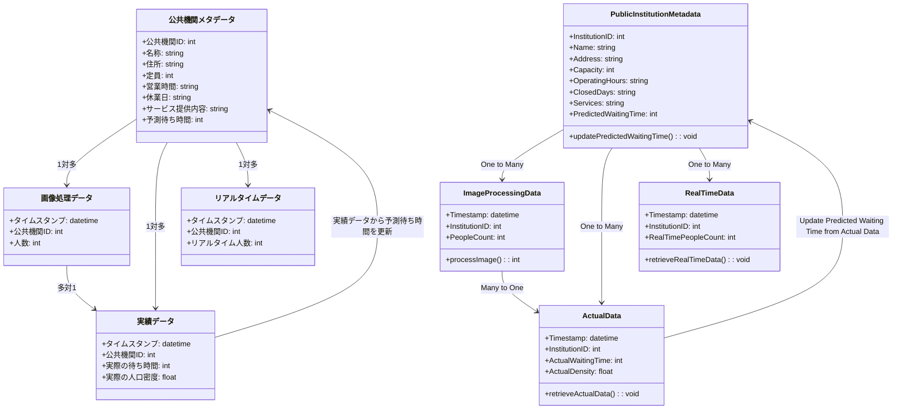

```mermaid
classDiagram
    class 公共機関メタデータ {
        +公共機関ID: int
        +名称: string
        +住所: string
        +定員: int
        +営業時間: string
        +休業日: string
        +サービス提供内容: string
        +予測待ち時間: int
    }

    class 画像処理データ {
        +タイムスタンプ: datetime
        +公共機関ID: int
        +人数: int
    }

    class 実績データ {
        +タイムスタンプ: datetime
        +公共機関ID: int
        +実際の待ち時間: int
        +実際の人口密度: float
    }

    class リアルタイムデータ {
        +タイムスタンプ: datetime
        +公共機関ID: int
        +リアルタイム人数: int
    }

    公共機関メタデータ --> 画像処理データ: 1対多
    公共機関メタデータ --> 実績データ: 1対多
    公共機関メタデータ --> リアルタイムデータ: 1対多
    画像処理データ --> 実績データ: 多対1
    実績データ --> 公共機関メタデータ: 実績データから予測待ち時間を更新

    class PublicInstitutionMetadata {
        +InstitutionID: int
        +Name: string
        +Address: string
        +Capacity: int
        +OperatingHours: string
        +ClosedDays: string
        +Services: string
        +PredictedWaitingTime: int
        +updatePredictedWaitingTime(): void
    }

    class ImageProcessingData {
        +Timestamp: datetime
        +InstitutionID: int
        +PeopleCount: int
        +processImage(): int
    }

    class ActualData {
        +Timestamp: datetime
        +InstitutionID: int
        +ActualWaitingTime: int
        +ActualDensity: float
        +retrieveActualData(): void
    }

    class RealTimeData {
        +Timestamp: datetime
        +InstitutionID: int
        +RealTimePeopleCount: int
        +retrieveRealTimeData(): void
    }

    PublicInstitutionMetadata --> ImageProcessingData: One to Many
    PublicInstitutionMetadata --> ActualData: One to Many
    PublicInstitutionMetadata --> RealTimeData: One to Many
    ImageProcessingData --> ActualData: Many to One
    ActualData --> PublicInstitutionMetadata: Update Predicted Waiting Time from Actual Data


```