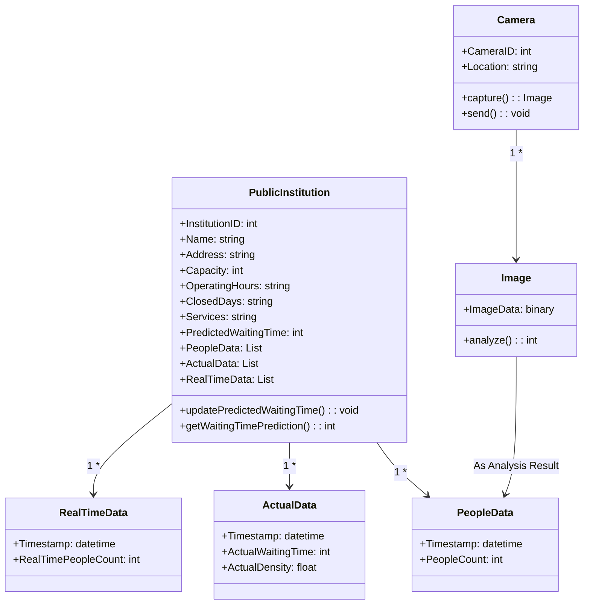

```mermaid
classDiagram
    class PublicInstitution {
        +InstitutionID: int
        +Name: string
        +Address: string
        +Capacity: int
        +OperatingHours: string
        +ClosedDays: string
        +Services: string
        +PredictedWaitingTime: int
        +PeopleData: List<PeopleData>
        +ActualData: List<ActualData>
        +RealTimeData: List<RealTimeData>
        +updatePredictedWaitingTime(): void
        +getWaitingTimePrediction(): int
    }

    class Camera {
        +CameraID: int
        +Location: string
        +capture(): Image
        +send(): void
    }

    class Image {
        +ImageData: binary
        +analyze(): int
    }

    class PeopleData {
        +Timestamp: datetime
        +PeopleCount: int
    }

    class ActualData {
        +Timestamp: datetime
        +ActualWaitingTime: int
        +ActualDensity: float
    }

    class RealTimeData {
        +Timestamp: datetime
        +RealTimePeopleCount: int
    }

    PublicInstitution --> PeopleData : 1 *
    PublicInstitution --> ActualData : 1 *
    PublicInstitution --> RealTimeData : 1 *
    Camera --> Image : 1 *
    Image --> PeopleData : As Analysis Result

```
